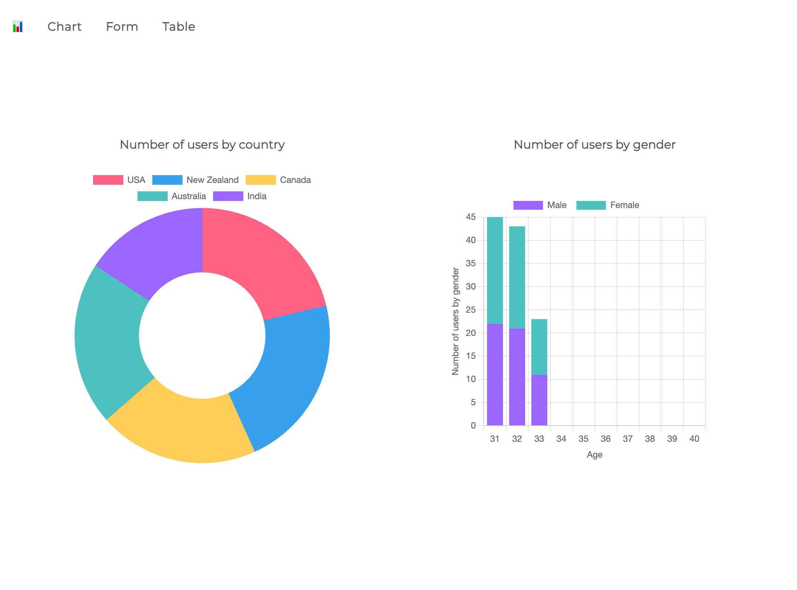
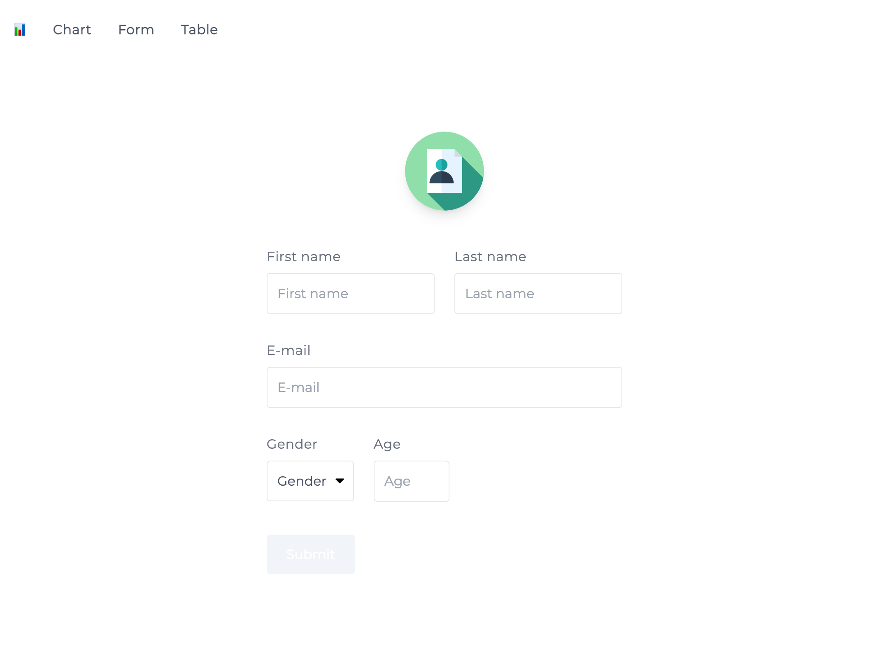
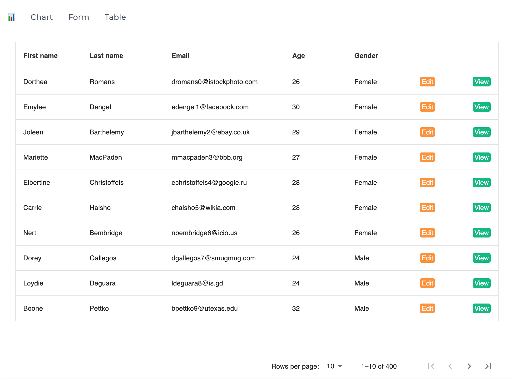

<!-- PROJECT LOGO -->
<br />
<div align="center">


<h3 align="center">Chart | Form | Table</h3>

  
</div>


## Screenshots


<div align="left">

  
  
</div>


<!-- GETTING STARTED -->
## Getting Started


### Prerequisites


* npm
  ```sh
  npm install npm@latest -g
  ```

### Installation

1. Clone the repo
   ```sh
   git clone https://github.com/amithjayapraban/chart-form-table.git
   ```
1. Install NPM packages
   ```sh
   npm install
   ```
1. Run
   ```sh
   npm run dev
   ```


